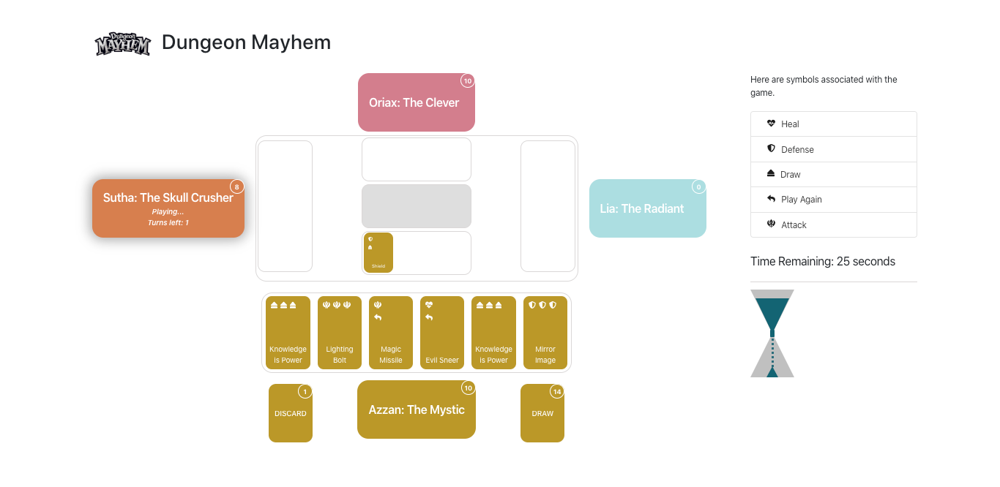

# Dungeon Mayhem Game created with Ruby on Rails and ReactJs

This repository is the implementation of the popular [Dungeon Mayhem](https://media.wizards.com/2019/dnd/downloads/DnD_Mayhem.pdf) using api build on [Ruby on Rails](https://rubyonrails.org/) and front-end build using [ReactJs](https://reactjs.org/) and using [Pubnub](https://admin.pubnub.com/) as broadcasting tool.


## Pre-requisites
  

### For Ruby on rails

  - Ruby 2.6.3

  - Rails 6.0.2.1

### For ReactJs

  - ReactJs 16.12.0
  
 #### Other requirements
  - npm 6.13.7
  
  - node v13.7.0
  
# Steps to Run the APP

This repository consists of two sections.
  - Rails API
  - React Front-End
 
So, we will need to run two projects seperately to play the game.

### Step 1: Setting Up Rails API
  
  **Step 1.1:** Navigate to Rails Project
  ```bash
    $ cd card-ruby
  ```
  **Step 1.2:** Bundle all related packages for project
  ```bash
    $ bundle install
  ```
  
  **Step 1.3:** Setting Up database
  ```bash
    $ rake db:migrate
  ```
 
  **Step 1.4:** Run rails server
   #### This game is played by multiplayer. So we need to host the api using our IP.
  ```bash
    $ rails server -b <your_ip> -p 3001
  ```
  
  This will run the rails api on port 3001: (http://<your_ip>:3001)
  

### Step 2: Setting Up React Front-End
  **Step 2.1:** Navigate to React Project
  ```bash
    $ cd card-react
  ```
  **Step 2.2:** Install all related packages for project
  ```bash
    $ npm install
  ```
  
  **Step 2.3:** Update API Link
  ```
  - Navigate to 'src/data/constants/'
  - Edit to apiroutes.js
  - set HostIP = <your api ip> 
   ```   
   **Step 2.3:** Setup Pubnub Credentials
  ```
  - Go to the [PubNub Admin Dashboard] (https://admin.pubnub.com/)
  - Create an application
  - Click on your application. 
  - Click on Keyset and scroll down to Application add-ons. 
  - Toggle the Presence switch to on. Keep the default values the same.
  
  - Navigate to 'src/data/constants/'
  - Edit to pubnub.js
  - set PUBNUB_PUBLISH_KEY = <publish_key_from_pubnub> 
  - set PUBNUB_SUBSCRIBE_KEY = <subscribe_key_from_pubnub> 
   ```     
  
  **Step 2.4:** Run the app
  ```bash
    $ npm start
  ```
  
  This will run the rails api on port 3000: (http://<your_ip>:3000)
  
  
## Preview (screenshots)


#### 1. Home


#### 2. Choosing Deck

#### 3. Game Create

#### 4. Join game

#### 5. Player List

#### 6. Game Board

#### 7. Game Hint

#### 8. Game End


## Testing the Rails APIs

**Step 1:** Navigate to Rails Project
  ```bash
    $ cd card-ruby
  ```
**Step 2:** Execute test
  ```bash
    $ bundle exec rspec
  ```


## License

MIT © [Technables](https://github.com/technables) 
  
  
## Credits and References
- [Overview](https://dnd.wizards.com/products/tabletop-games/rpg-products-board-card-games/dungeon-mayhem)
- [Rules](https://media.wizards.com/2019/dnd/downloads/DnD_Mayhem.pdf)
- [Wikipedia Definition](https://en.wikipedia.org/wiki/Boggle)
- [React-Tic-Tac-Toe](https://github.com/ocastroa/react-tictactoe)
- [Pubnub](https://admin.pubnub.com/)
  

